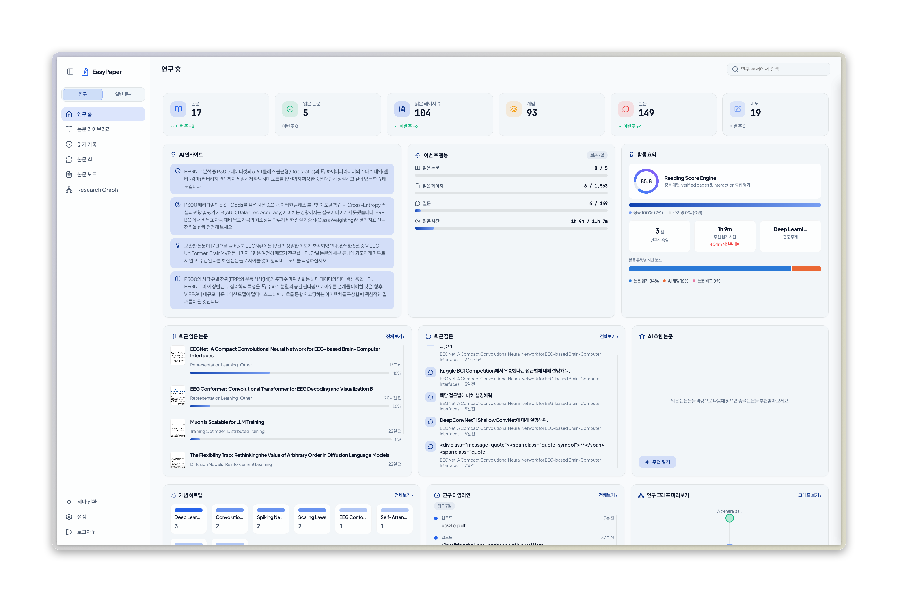
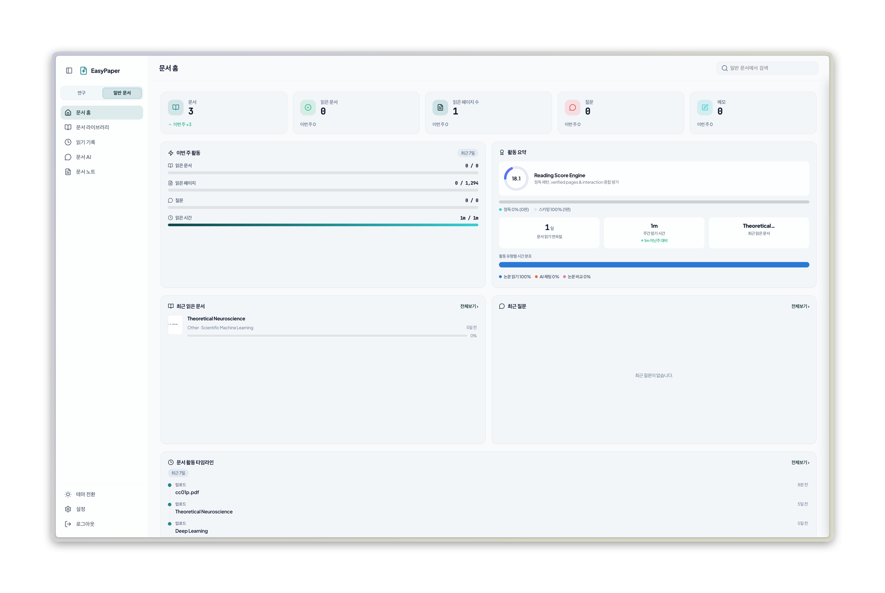
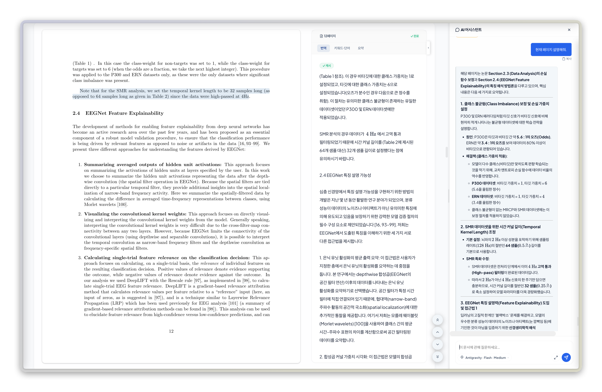
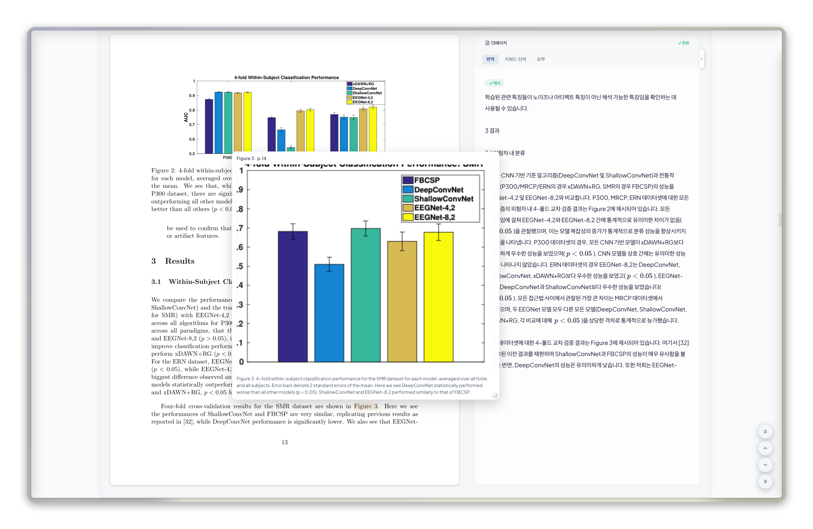
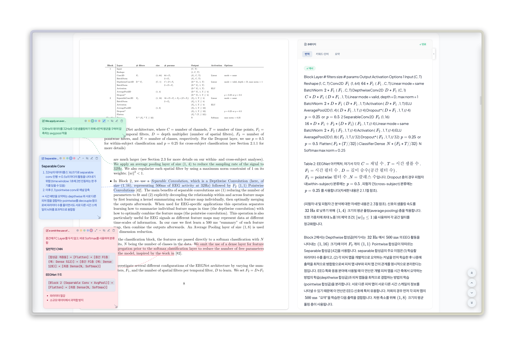
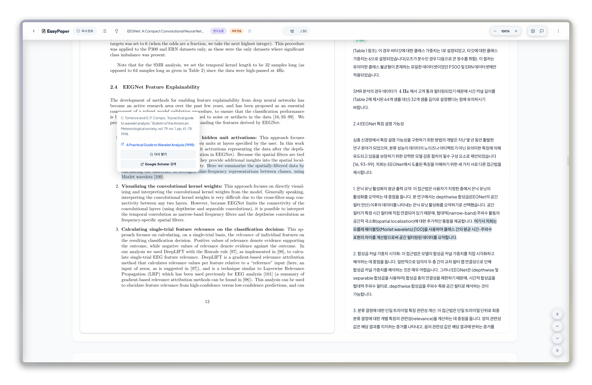
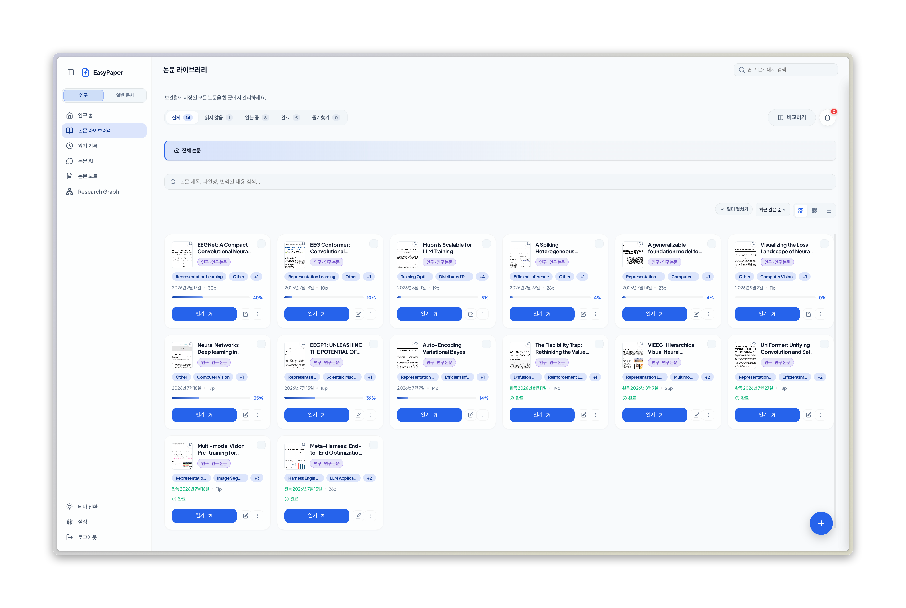
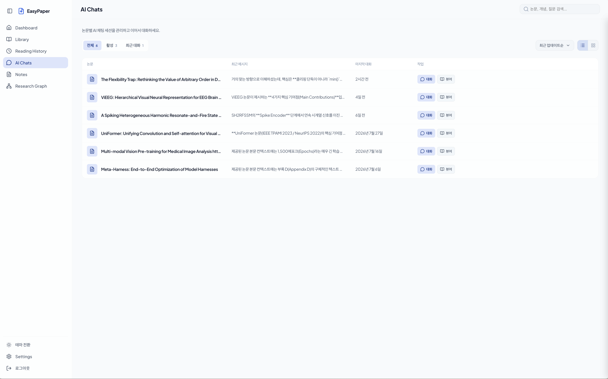
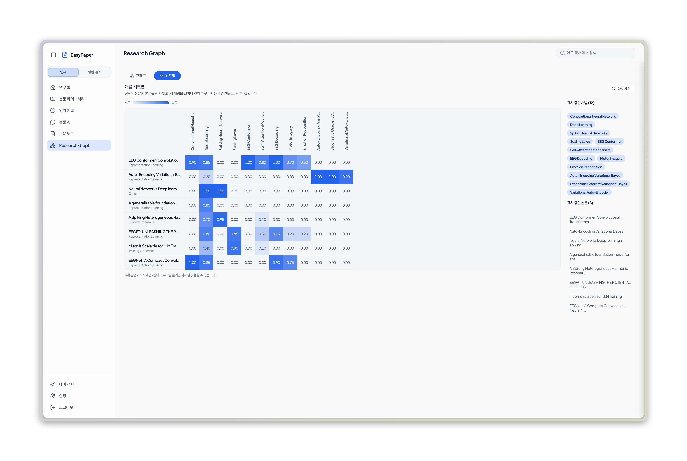
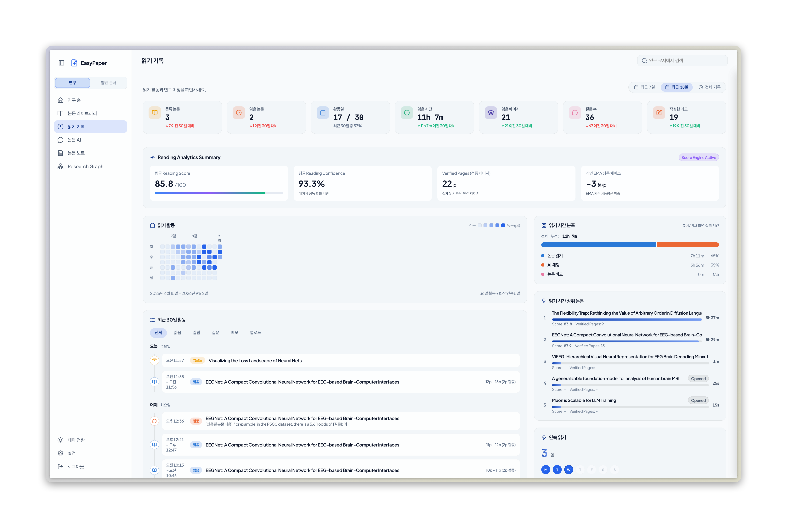

<div align="center">


[](./README.ko.md)

[](https://github.com/orion-gz/EasyPaper/stargazers)
[](https://github.com/orion-gz/EasyPaper/releases) [](https://github.com/orion-gz/EasyPaper/actions)
[](https://github.com/orion-gz/EasyPaper/commits/main)

  

</div>

EasyPaper is a web and desktop workspace for translating, reading, annotating, and discussing PDFs with AI. Use local Ollama, Gemini, Claude, OpenAI, or supported CLI providers including Antigravity, Claude Code, and Codex.

<p align="center">
  
  <sub>Research mode workspace</sub>
</p>

## Two reading modes

| Mode | For | What it emphasizes |
|---|---|---|
| Research mode | Papers, surveys, theses, preprints, and academic reports | Paper structure, methods, evidence, citations, research graphs, comparisons, and pre-reading briefs |
| General document mode | Technical documentation, books, articles, reports, manuals, policies, presentations, and other general documents | Document-aware translation, summaries, vocabulary, focused Q&A, full-text search, and document overviews |

Both modes currently accept PDF files. General document mode lets you use features appropriate to the purpose and type of each document.

<details>
<summary>More screenshots</summary>

<br>

| | |
|---|---|
|  |  |
| Research mode dashboard | General document mode dashboard |
|  |  |
| Viewer and AI assistant | Figure and image reference overlay |
|  |  |
| Annotations and floating memos | Citation reference overlay |
|  |  |
| Library | AI Chats |
|  |  |
| Research graph heatmap | Reading records |

</details>

## Features

- Side-by-side source and AI translation with sentence-level alignment
- Context-aware AI chat, pre-reading briefs, summaries, and vocabulary support
- Research workspace with library, AI Chats, research graph, reading analytics, and recommendations
- Annotations, highlights, floating memos, and annotated PDF export
- Reference, figure, table, and equation overlays for research PDFs
- Native desktop apps for Windows, macOS, and Linux, plus a self-hosted web app

## Quick start

### Desktop app

You can download the installer for your platform from the [latest release](https://github.com/orion-gz/EasyPaper/releases/latest). The Tauri desktop app includes the backend sidecar, so no additional Python or Node.js installation is required.

| OS | Installer |
|---|---|
| Windows | `.msi` or `.exe` |
| macOS (Apple Silicon) | `_aarch64.dmg` |
| Linux | `.AppImage`, `.deb`, or `.rpm` |

At first launch, choose and configure an AI Provider in the onboarding flow. Unsigned desktop builds can trigger an operating-system security warning.

> [!IMPORTANT] Note
> macOS: Because the app is not fully signed, recent versions of macOS (Ventura and later) may show the misleading message “The application cannot be opened because it is damaged” instead of allowing you to bypass the warning with right-click → Open. The file is not actually damaged; this is caused by the quarantine attribute added during download. Remove it in Terminal with the command below, then try again.
> ```bash
> xattr -cr /Applications/EasyPaper.app
> ```
> Windows: On the “Windows protected your PC” screen, select More info → Run anyway to install normally.

### Run from source

Requirements: Python 3.8+, Node.js 16+, and npm. Ollama is optional.
The scripts below make setup and startup straightforward.

```bash
git clone https://github.com/orion-gz/EasyPaper.git
cd EasyPaper
./scripts/sh/setup.sh
./scripts/sh/start.sh
```

On Windows, run `scripts\bat\setup.bat`, then `scripts\bat\start.bat`. Open `http://localhost:8000` after the server starts.

## Docker

```bash
git clone https://github.com/orion-gz/EasyPaper.git
cd EasyPaper
docker compose up -d --build
```

Open `http://localhost:8000`. Data is persisted in the `/data` volume. To stop the service, run `docker compose down`.

## Initial account

| Field | Value |
|---|---|
| Username | `admin` |
| Password | `admin` |

Change these credentials in Settings after signing in.

## Testing

```bash
cd backend
.venv/bin/pip install -r requirements-dev.txt
.venv/bin/python -m pytest tests/ -v
```

```bash
cd frontend
npm install
npm run build
npm run test:e2e
```

## CLI-based AI Providers

EasyPaper detects installed and authenticated `agy`, `claude`, and `codex` CLIs at startup. Select any detected provider from the model picker; API providers and Ollama remain available as alternatives.

See [CHANGELOG.md](./CHANGELOG.md) for release notes.
